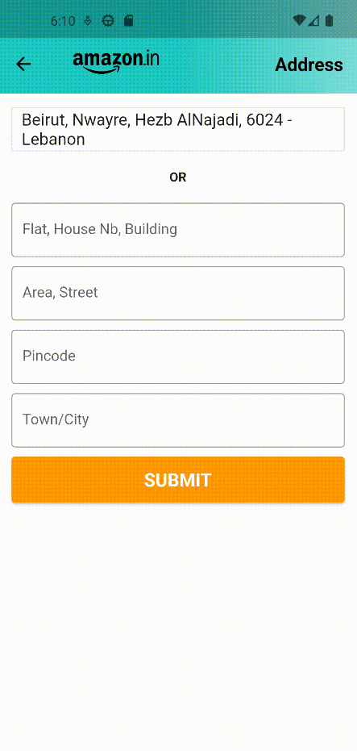

# Amazon Clone 
> Hello world! This is the project’s summary that describes the project plain and simple, limited to the space available.

> This is a Full Stack Mobile application and my second experience to learn and code with Flutter Framework as main project goal by cloning simple amazon ecommerce.

**[USER STORIES](#user-stories) • [IMPLEMENTATION](#implementation) • [INSTALLATION](#installation)**

## Stacks
#### Frontend: 
- Flutter
#### Backend:
- NodeJS, MongoDB

<a id="user-stories"></a>
## User Stories:
#### &nbsp; &nbsp; &nbsp; As User:

- I want to add products to my cart anytime I want.
- I want to search and filter products by name or category.
- I want to view all my orders.
- I want to submit and finalize my order.

#### &nbsp; &nbsp; &nbsp; As an Admin:

- I want to be able to view all products.
- I want to be able to view add products.
- I want to be able to view delete any product.
- I want to be able to view all orders.
- I want to be able to view products sold by categories statistics and total earnings.

<br></br>
<a id="implementation"></a>

## Implementation
---------------
### User:
---------------
| Login | SignUp | Home | Category |
| ------- | ------------ | -------- | --------- |
|| |||

| Search Input | Search Screen | Product Details | Add Review/To Cart |
| ------- | ------------ | -------- | --------- |
|| |||

| Cart | Increment Quantity Cart | Submit Order | My Orders |
| ------- | ------------ | -------- | --------- |
|| |||

<br></br>
---------------

### Admin
---------------
| All Products | Delete Product | Add Product | Statistics |
| ------- | ------------ | -------- | --------- |
|| |||

| All Orders | 
| ------- |
|| 

<br></br>
<a id="installation"></a>

## Installation
1. Clone the repo
   ```sh
   git clone https://github.com/mohammadammash/amazon_clone.git
   ```
2. Navigate to the backend folder and run the following commands:
   ```sh
   npm install
   #[After npm install terminates successfully]:
  -Copy '.env.example' file and rename it to '.env' and fill the empty variables
   #[Finally run your server]
   npm start
   ```
3. Navigate to the frontend folder and run following commands:
   ```sh
   flutter pub get
   #[Navigate to src/networks/base.ts and replace base url by current local IPv4:Port]
   run with or without debugging on your emulator
   ```
4. Enjoy your tour🎉.